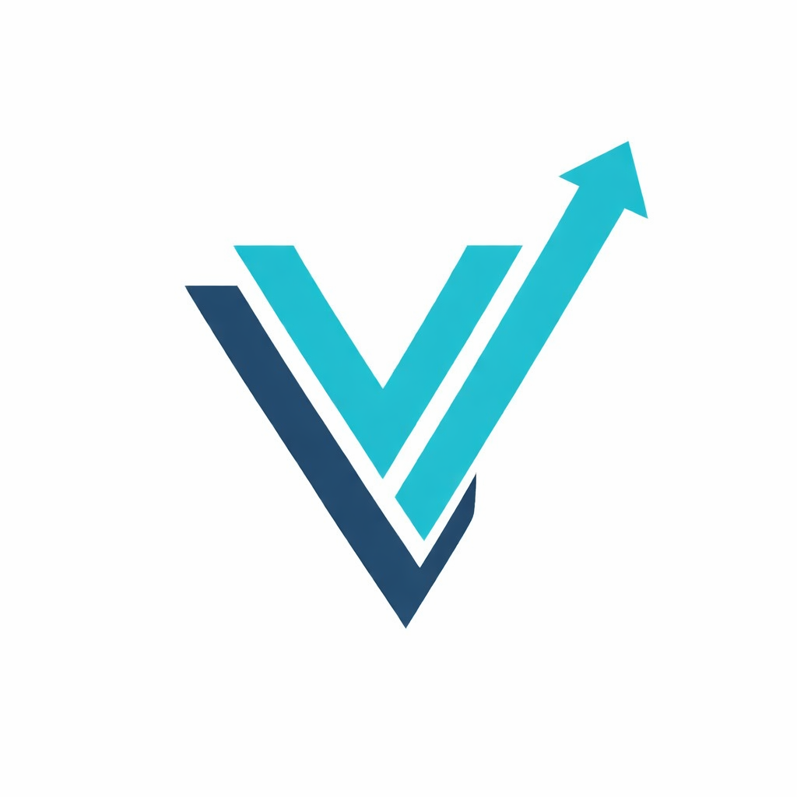

# Português - BR

# Vyte Tech — Site Oficial



> **Onde código vira solução.**
> A Vyte Tech é uma empresa de tecnologia focada no desenvolvimento de soluções digitais modernas, escaláveis e de alto desempenho.

---

## 📌 Sobre o Projeto

Este repositório contém o **site oficial da Vyte Tech**, desenvolvido com um stack moderno de frontend, com foco em:

- Performance
- SEO
- Acessibilidade
- Design responsivo
- Arquitetura limpa e escalável

O site representa a identidade visual da Vyte Tech e atua como uma plataforma institucional e de marketing.

---

## 🚀 Tecnologias Utilizadas

- **Vite** — Ferramenta moderna e rápida para frontend
- **React + TypeScript** — Interface baseada em componentes com tipagem segura
- **Tailwind CSS** — Estilização utilitária e responsiva
- **Design System (tokens em HSL)** — Identidade visual consistente
- **SEO & Open Graph** — Otimização para buscadores e redes sociais

---

## 🎨 Design & Experiência do Usuário (UX)

- Tema dark premium com identidade tech
- Layout responsivo (mobile, tablet e desktop)
- Animações sutis e efeitos de glow
- Hierarquia visual otimizada para leitura e conversão

---

## 📁 Estrutura do Projeto

```
├─ public/              # Arquivos estáticos (favicon, OG images)
├─ src/
│  ├─ assets/           # Imagens e logos
│  ├─ components/       # Componentes reutilizáveis
│  ├─ pages/            # Seções/páginas do site
│  ├─ styles/           # Estilos globais e design system
│  └─ main.tsx          # Ponto de entrada da aplicação
├─ index.html           # HTML base + metadados de SEO
├─ package.json         # Dependências e scripts
└─ vite.config.ts       # Configuração do Vite
```

---

## 🧠 SEO & Metadados

O projeto inclui:

- `<title>` e meta description otimizados
- Open Graph e Twitter Cards
- Favicon e dados estruturados (`Schema.org`)

Essas configurações garantem melhor indexação em mecanismos de busca e previews corretos em redes sociais.

---

## 🏢 Sobre a Vyte Tech

A Vyte Tech oferece:

- Desenvolvimento de software sob medida
- Sistemas e aplicações web
- Consultoria em tecnologia
- Arquiteturas escaláveis e seguras

🌐 Site: [https://vytetech.com.br](https://vytetech.com.br)
📍 São Paulo — Brasil

---

## 📄 Licença

Este projeto é proprietário e mantido pela **Vyte Tech**.

Todos os direitos reservados.

---

**Vyte Tech — Onde código vira solução.**

---

# English - US

# Vyte Tech — Official Website


> **Where code becomes solutions.**  
> Vyte Tech is a technology company focused on building modern, scalable, and high-performance digital solutions.

---

## 📌 About the Project

This repository contains the **official Vyte Tech website**, built with a modern frontend stack, focused on:

- Performance
- SEO
- Accessibility
- Responsive design
- Clean and scalable architecture

The website represents Vyte Tech’s visual identity and serves as an institutional and marketing platform.

---

## 🚀 Technologies Used

- **Vite** — Fast and modern frontend tooling
- **React + TypeScript** — Component-based UI with type safety
- **Tailwind CSS** — Utility-first and responsive styling
- **Design System (HSL tokens)** — Consistent visual identity
- **SEO & Open Graph** — Optimization for search engines and social media

---

## 🎨 Design & User Experience (UX)

- Premium dark tech theme
- Responsive layout (mobile, tablet, and desktop)
- Subtle animations and glow effects
- Optimized visual hierarchy for readability and conversion

---

## 📁 Project Structure

```
├─ public/                # Static assets (favicon, OG images)
├─ src/
│ ├─ assets/              # Images and logos
│ ├─ components/          # Reusable components
│ ├─ pages/               # Website sections/pages
│ ├─ styles/              # Global styles and design system
│ └─ main.tsx             # Application entry point
├─ index.html             # Base HTML + SEO metadata
├─ package.json           # Dependencies and scripts
└─ vite.config.ts         # Vite configuration
```

---

## 🧠 SEO & Metadata

The project includes:

- Optimized `<title>` and meta description
- Open Graph and Twitter Cards
- Favicon and structured data (`Schema.org`)

These configurations ensure better indexing by search engines and proper previews on social platforms.

---

## 🏢 About Vyte Tech

Vyte Tech delivers:

- Custom software development
- Web systems and applications
- Technology consulting
- Scalable and secure architectures

🌐 Website: https://vytetech.com.br  
📍 São Paulo — Brazil

---

## 📄 License

This project is proprietary and maintained by **Vyte Tech**.

All rights reserved.

---

**Vyte Tech — Where code becomes solutions.**
